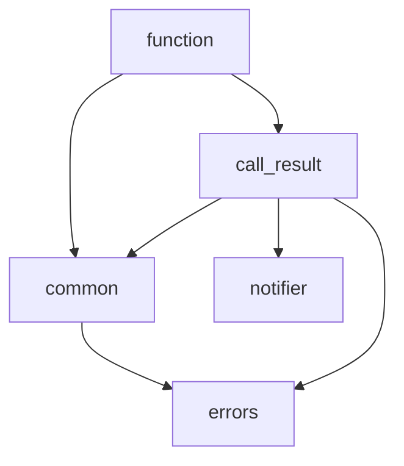

## Glossary
* **observable**: Anything that can be evaluated and reports when it changes (via notifier).
* **notifier**: An object that allows listening for notifications of changes. 

## Dependencies
